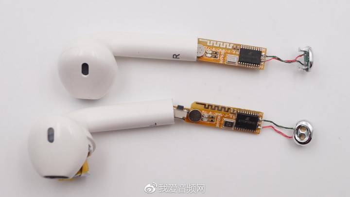
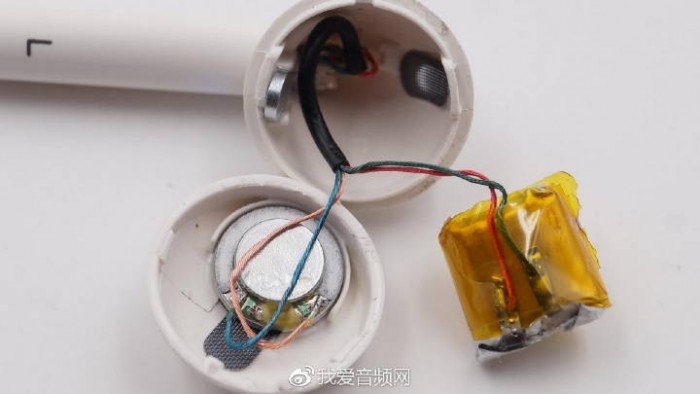

# 华强北 Airpods 改装设想

华强北 airpods 是一种不算廉价的无线耳机产品，我们惊艳的可能是它能做出与真苹果耳机相同的外观，而且做工也不算太差，就这，1xx 的价格确实让我们惊讶，不过在使用过后，明显感觉到多少有不足之处。

 - 延迟： 这一定会有，毕竟 1xx 的价格摆在那里，芯片能有多好？
 - 续航： 续航能力上，相对于原装会差很多，如果重度使用，会比较失望
 - 音质： 重低音感强烈，相对于原装耳机，差别不是特别大，但是还有改进的空间
 - 做工： 没有改装的必要，与原装区别最大的就是电池仓的指示灯，反磁效果还可以

## 芯片
 - 1536： 通话质量比较差，蓝牙的连接效果还行，续航也差一点，大约 2：30 的续航
 - 1536u： 1536 的增强版，通话质量依然差，比 1536 好一点，续航能达到 3：30

## 耳机电池
 - 电池柱： 其实这是不现实的，毕竟耳机柱那么小，还要往里面塞芯片，怎么可能放得下电池柱

 - 电池包： 确实是电池包，如果电池包能大一点，续航就能往上走，这个不知道有没有改动的可能性

## 发声单元
 - 发声单元： 可以换成苹果有线原装的发声单元，但是不知道续航会不会有所变化

## 电池仓
 - 电池仓： 这个不在关注的重点，毕竟电池仓就是充电站而已，多大也没所谓，重点是耳机的电池容量